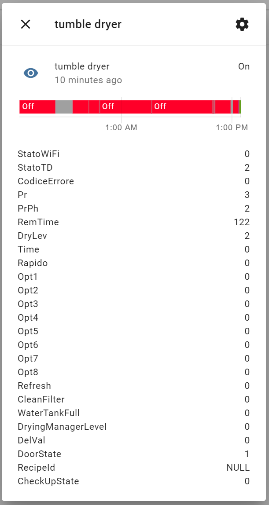
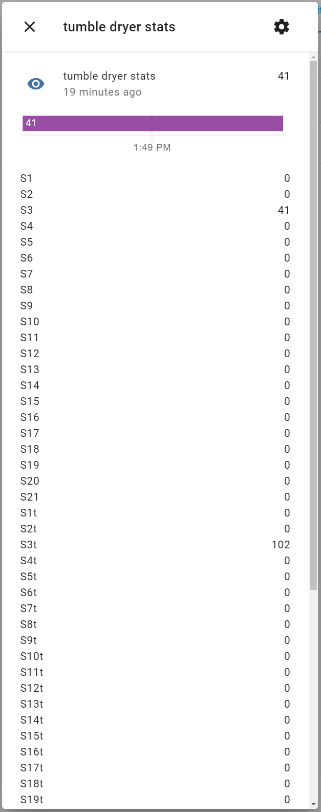

# haier_appdaemon
An AppDaemon (Home Assistant) script to communicate with WiFi enabled appliances from Haier group (e.g. Hoover, Candy).

This script is intended to be used with AppDeamon https://appdaemon.readthedocs.io/

You will need to find the encytpion key for your device, info on how to obtain it is available here:

https://community.home-assistant.io/t/dishwasher-candy-simply-fi-cdi-6015-wifi/136543

It adds two entities to Home Assistant, one containing the status (whether it is on or off plus more details in the attributes) and another containing various counters/statistics.  The attributes are dumped exactly as they are returned from the appliance and will depend on the appliance type.  A lot of the statistics do not have descriptive names so you may need to compare values in the official apps to work out which ones refer to the values you care about.

I wrote this for my own use, if it is useful to anyone else then great.
